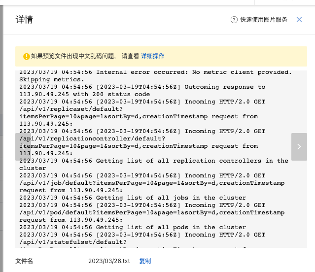
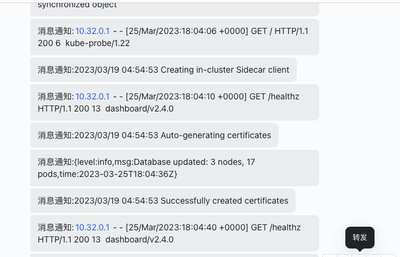

# gsmini-log-operator
一个日志收集的operator

## Description
一个日志收集的operator，支持数据源配置和报警目标配置。如输出到mysql，oss，es等，通过电话报警
企业微信等。
目前支持
- oss日志写入
- 飞书群报警通知



> oss文件写入


> 飞书报警支持

## Getting Started


### Running on the cluster
1. Install Instances of Custom Resources:

```sh
apiVersion: apps.gsmini.cn/v1
kind: GsminiLog
metadata:
  name: gsminilog-sample 
  namespace: default //会监控目标ns下面所有的contaner日志
spec:
    //输出到oss
    log_destination: "oss" 
    //aliyu oss配置
    log_dest_uri: "endpoint|access key|access secret|bucket name"
    //通知到飞书
    log_report_type: "feishu"
    //飞书机器人通知地址
    log_report_uri: "https://xxxxxx/bot/v2/hook/xxxxxx"
    //日志过滤规则目前没实现这个功能
    log_rule: "*"

```
> kubectl -f xx.yaml

2. Build and push your image to the location specified by `IMG`:

```sh
make docker-build docker-push IMG=<some-registry>/gsmini-log-operator:tag
```

3. Deploy the controller to the cluster with the image specified by `IMG`:

```sh
make deploy IMG=<some-registry>/gsmini-log-operator:tag
```

### Uninstall CRDs
To delete the CRDs from the cluster:

```sh
make uninstall
```

### Undeploy controller
UnDeploy the controller from the cluster:

```sh
make undeploy
```


### How it works
This project aims to follow the Kubernetes [Operator pattern](https://kubernetes.io/docs/concepts/extend-kubernetes/operator/).

It uses [Controllers](https://kubernetes.io/docs/concepts/architecture/controller/),
which provide a reconcile function responsible for synchronizing resources until the desired state is reached on the cluster.

### Test It Out
1. Install the CRDs into the cluster:

```sh
make install
```

2. Run your controller (this will run in the foreground, so switch to a new terminal if you want to leave it running):

```sh
make run
```

**NOTE:** You can also run this in one step by running: `make install run`

### Modifying the API definitions
If you are editing the API definitions, generate the manifests such as CRs or CRDs using:

```sh
make manifests
```

**NOTE:** Run `make --help` for more information on all potential `make` targets

More information can be found via the [Kubebuilder Documentation](https://book.kubebuilder.io/introduction.html)

## License

Copyright 2023.

Licensed under the Apache License, Version 2.0 (the "License");
you may not use this file except in compliance with the License.
You may obtain a copy of the License at

    http://www.apache.org/licenses/LICENSE-2.0

Unless required by applicable law or agreed to in writing, software
distributed under the License is distributed on an "AS IS" BASIS,
WITHOUT WARRANTIES OR CONDITIONS OF ANY KIND, either express or implied.
See the License for the specific language governing permissions and
limitations under the License.

